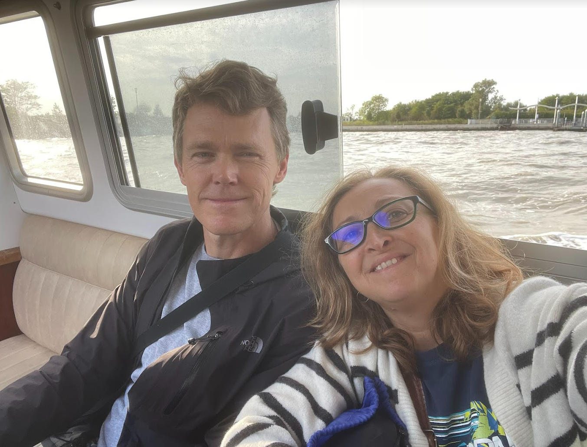
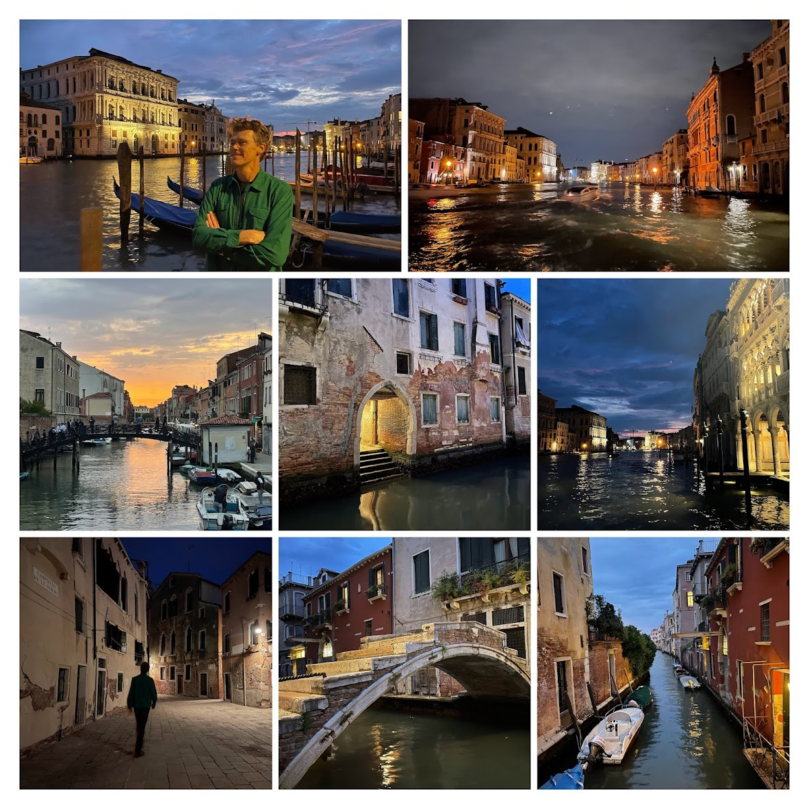

# Trips to UK, Italy, Spain and US

- [UK](#uk)
  - [Leeds](#leeds)
  - [London with Greg](#london-with-greg)
    - [30 August 2024](#30-august-2024)
    - [31 August 2024](#31-august-2024)
  - [London with Mum and Sister](#london-with-mum-and-sister)
- [Italy](#italy)
  - [19 September, Leeds to Venice:](#19-september-leeds-to-venice)
  - [20 September, Venice:](#20-september-venice)
  - [21 September, Venice:](#21-september-venice)
  - [22 September, Venice to Padua:](#22-september-venice-to-padua)
  - [23 September, Padua to Ravenna for me and Greg, to Bologna for
    U&H.](#23-september-padua-to-ravenna-for-me-and-greg-to-bologna-for-uh)
  - [24 September, Ravenna to
    Florence](#24-september-ravenna-to-florence)
  - [25 September, Florence full day](#25-september-florence-full-day)
  - [26 September, Florence to Parma](#26-september-florence-to-parma)
  - [27 September, Parma to Lago de
    Como](#27-september-parma-to-lago-de-como)
  - [28 September, Como full day](#28-september-como-full-day)
  - [29 September, Como to Millan and from Milan to CT and to Spain for
    me.](#29-september-como-to-millan-and-from-milan-to-ct-and-to-spain-for-me)
- [Spain](#spain)
- [US](#us)

# UK

## Leeds

## London with Greg

### 30 August 2024

- Greg arrives in London on the 30th of August, we meet up at Brunswick
  Square in London. We are staying at a place with a small kitchen
  called [Cleveland
  Residences](https://maps.app.goo.gl/u78fypqrxZ7bhzpx8). We immediately
  set off to explore the London scenes.

### 31 August 2024

- Saturday parkrun - \### 1 September 2024

- In the morning we did a city run:

- [British Museum](https://photos.app.goo.gl/8uuSYqawMpcVGzKo9) Rosetta
  Stone, Cyrus Cylinder, Halikarnassos Mausoleum, and some impressive
  Assyrian stuff. Since we had limited time, catching the train back to
  Leeds, we had to cut it short.

- 

## London with Mum and Sister

# Italy

This part is very complicated!

### 19 September, Leeds to Venice:

Me and Greg arrived in Venice. We left Leeds by bus to Manchester and
flew to Venice. Took the Allilaguna line from the airport to the main
island:

We had chicetti for dinner by the canal at some steps? Venice at night
time is spectacular:

### 20 September, Venice:

In the morning, me and Greg went for a run, hoped to come back and
shower and rest but there was a vaporetto strike so we decided to go to
the Academia, then it was high tide time (12:30 noon) which meant we had
to go to St Mark’s Sq to see the water rising. Then since we were there,
we might as well go the Biennale which is right there by the gardens.
Quite the tiring day on our feet. 30k steps! We went to the train
station and met with U&H who were travelling for 24 hrs! Then had
prosecco by the steps and

### 21 September, Venice:

St Mark’s Basilica, then to the other Biennale venue, Arsenal. Went out
for meal.

### 22 September, Venice to Padua:

In the morning Greg goes for a long run, I take the vaporetto, and meet
up with U&H by the coffee shop.

After check-out we leave by train to Padua. We arrive in Padua, walk
around the market, and arrive at our Palazo. Beautiful place. We are
starving so we had some bread, cheese, tomato, wine.

In the evening, we go out for Greg’s birthday dinner. Nice place.

### 23 September, Padua to Ravenna for me and Greg, to Bologna for U&H.

### 24 September, Ravenna to Florence

### 25 September, Florence full day

### 26 September, Florence to Parma

### 27 September, Parma to Lago de Como

### 28 September, Como full day

### 29 September, Como to Millan and from Milan to CT and to Spain for me.

# Spain

# US
